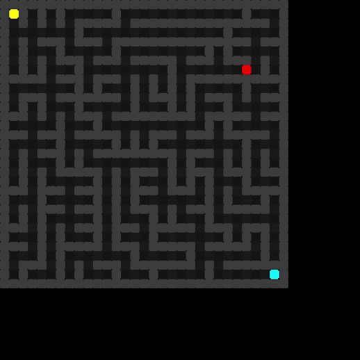
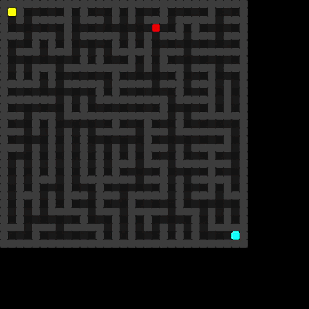

# 🧠 *SmartMaze* 

Repositório criado para abrigar as entregas da **Avaliação A3** da unidade curricular **Inteligência Artificial**, ministrada pelos professores **Leandro Pereira** e **Saulo Popov Zambiasi**, na **UNISUL**.

---

## 🎯 Objetivo

Desenvolver um projeto prático utilizando uma das técnicas de Inteligência Artificial estudadas em aula.  
O desafio escolhido pelo grupo foi:

> **"Como fazer com que um inimigo em um ambiente de labirinto aprenda, de forma autônoma, os caminhos mais eficientes para alcançar o jogador, adaptando-se dinamicamente ao ambiente e ao comportamento do jogador?"**

---

## 🕹️ Sobre o Projeto

Criamos um **jogo de labirinto** em que o jogador (usuário) deve chegar ao final do labirinto **sem ser alcançado por um inimigo inteligente**.  
Caso o inimigo atinja o jogador, o jogo termina.

Para tornar esse inimigo mais realista e desafiador, utilizamos a técnica de **Agentes Inteligentes**, com o algoritmo **A*** (A-estrela).  
Esse algoritmo permite que o inimigo calcule, em tempo real, **a rota mais curta até o jogador**, com base em uma função heurística.

---

## 🤖 Técnica de IA Utilizada

- **Agentes Inteligentes**
- **Algoritmo A\*** para cálculo da rota ótima
- Tomada de decisão baseada em heurística (inteligência reativa e adaptativa)

---

## 👩‍💻 Integrantes do Grupo

| Nome                  | RA           | E-mail                             |
|-----------------------|--------------|------------------------------------|
| Hellen Machado Borba  | 1072312050   | hellenmborba@outlook.com           |
| Julia Freitas Rabelo  | 10723115807  | julia.freitasrabelo@gmail.com      |
| Letícia Beatriz Souza | 1072318584   | leticiabeasouza@gmail.com          |
| Maria Luiza Garcia    | 1072310864   | maluhgarcia2311@gmail.com          |

---

## 🚧 Status do Projeto

🟡 **Em desenvolvimento**

---

## 🛠️ Tecnologias Utilizadas

- Linguagem: *Python*
- Técnicas de IA: Agentes inteligentes, algoritmo A*
- Bibliotecas e ferramentas: *Pygame*

---

## 📸 Demonstrações 

---

